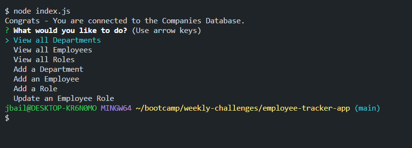

# 12 - Employee Tracker App - SQL

## Table of Contents
- [Project Description](#description)
- [Installation](#installation)
- [Usage](#usage)
- [License](lLicense)
- [Contributing](#contributing)
- [Questions](#questions)

## Description
For this Week 12 Challenge we were tasked to create an Employee Tracker CRM that could handle a variety of tasks such as: View All Departments/Employees/Roles while also being to add new ones in all of those categories as well. Additional functionality in being able to update an Employee role! 

## Installation
For installation instructions please visit my github repo https://github.com/joshbaileydev513/employee-tracker-app to clone and review the README provided.

## Usage
To use this app you first need to make sure you have installed the dependancies for console table, express, dotenv, inquirer, and mysql. Once that is finished you can invoke the application in the command line by entering node index which will present you with the options for this specific employee tracker crm. You can use the arrow keys to view all Departments/Employees/Roles while also being to add new ones in all of those categories as well. The last item allows you to additionally update an employee role within the database as well!

Link to Video: https://drive.google.com/file/d/1MxMxuChFkPhmdQnELQQSu44eJEB15nco/view 

## License
MIT
https://opensource.org/licenses/MIT

## Contributing
Joshua Bailey and EdX/UNCC Coding Bootcamp for some previous code examples/starter code!

## Questions
For any questions please reach out to me via GitHub `https://github.com/joshbaileydev513` or Email `jbailey2124@gmail.com`